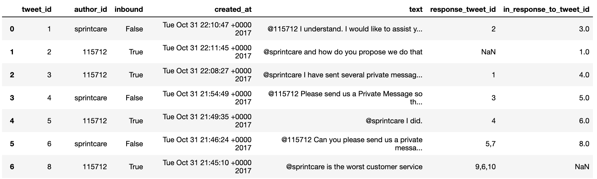

# The Natural Process of Language Processing 

## Table of Contents

## Introduction
72% of U.S smartphone users use less than 7 apps in a day. In response to this consumer behavior, the social platforms that we all know and love have started letting companies build chatbots with them.

 The chatbot can talk to you through different channels, such as Facebook Messenger, Siri, WeChat, Twitter, SMS, Slack, Skype, among others. 23.5 trillion WhatsApp messages sent every year. Twitter also holds a huge influence in the electronic messaging space. For example, there were 103 million tweets sent about the Winter Olympic Games and, in total, this led to 33.6 billion Impressions (views on and off Twitter) of tweets.

So first I wanted to explore if I would be able to predict a response to a general question given the dataset.
## Data 
I decided to work with a twitter customer question and response data set that included a total of 2,811,774 tweets and was directed at 108 different companies. The dataset had 7 columns. 

<code>tweet_id  author_id	inbound  created_at text response_tweet_id in_response_to_tweet_id</code>

## EDA
I merged question tweets with response tweets on author_id and response_tweet_id. Getting the paired QA data was in my mind the first step the being able to predict answers given questions. 

From here I was interested in the emojis in the text. I was able to run the text through a spacy pipeline with an emoji paser. I managed to get the most frequent emojis used by customers directed at companies. Mostly emojis themed in frustration.

I then used scattertext with a spacy pipline to plot a spatial word frequency plot with blue representing Apple Support and the red is Amazon Help. This graph basically shows that there are alot of similar words used by both groups represented by the light yellow are in the middle of the plot.  The top left corner represents most frequent words used specifically by Apple Support while the bottom right plotted words are representative of frequent words characteristic to Amazon Help.

There is a package called empath that once imported with scattertext can group words into topics.

After visualizing topics with scattertext I decided to take just Apple Support data and run hard and soft clustering on the text data to see if one would be better at predicting cluster trends in data for more accurate responses.

## Model

### K-means / Hard Clustering
I first plotted distortion of my X_train in reference to cluster number to visualy see where the elobow of inflection seemed to be. I chose 13 as my number of topics because it is the point in which distortion is at its lowest. 

Distortion: mean sum of squared distances to centers

Customer Questions:

In general the question topics seem to all have a similar theme of buggy updates. Clusters 2,3,4,8,10 and 11 all deal with iphone update and crashing in varying degrees.

Company Responses:

Company responses seemed to be a bit more polite than their customer counterparts. Cluster 0 does look like a response to cluster 0 in Customer Questions. Other than that one cluster it was hard for me to match QA clusters using k-means model. There is definitely structure in the cluster but interpritability isnt as clear. 

### LDA / Soft Clustering 
Customer Questions:

The soft clustering provided by LDA allows for a little more insight into what the update issue is in each topic. For example, Topic 1 deals with battery issues. Topic 2 with high sierra ios problems. 

Company Responses:

It seems that with a considerably less perplexity metric that the responses to customer questions are bottlenecked and clustered better. Which leads me to believe that the dataset could possibly be good to train a twitter chat bot for Apple Support. 

## Future Work 
I would like to find a way using clustering to predict a questions cluster through one of the models. Then give the topic number return a generic response for the theme of the topic question.

I would also like to apply RNN and Seq2Seq to my X and y text to hopefully get a more intuitive way to predict responses given a question. 

